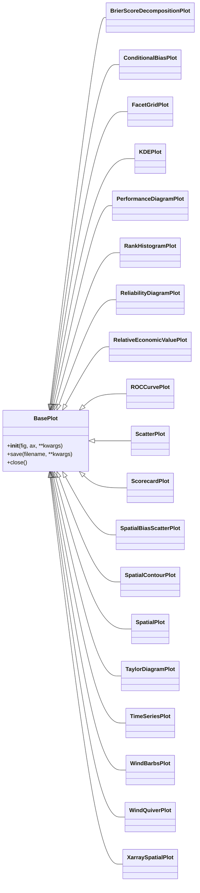

# Verification Plots Architecture

This document outlines the high-level architecture, design principles, module responsibilities, and extensibility patterns for the verification plots system.

## 1. System Overview and Design Principles

The verification plots system is built upon a clear **Separation of Concerns** principle, dividing responsibilities between statistical computation and visualization.

**Design Principles:**

*   **Consistency:** All plots inherit from [`BasePlot`](../../src/monet_plots/plots/base.py) to enforce consistent styling (via `wiley_style`) and standard figure lifecycle management (`__init__`, `save`, `close`).
*   **Decoupling:** Statistical calculation logic is entirely decoupled from visualization logic, residing in the utility module [`verification_metrics.py`](../../src/monet_plots/verification_metrics.py).
*   **Object-Oriented Visualization:** Each specific plot type is realized as its own class, inheriting from `BasePlot`. This encapsulates the data processing and rendering specific to that plot type within a single object.

## 2. Class Hierarchy Diagram

All verification plots extend the abstract base class [`BasePlot`](../../src/monet_plots/plots/base.py), providing standardized figure handling.



## 3. Data Flow Diagram

This diagram illustrates the general flow for verification plot generation, assuming input data is pre-loaded into a structure like a Pandas DataFrame.

```mermaid
flowchart TD
    A[Input Data (DataFrame/xarray)] --> B{Concrete Plot Class};
    B -- Initial Setup/Style --> BasePlot;
    B -- Prepares Data --> C[Plot Specific Logic];
    C -- Calls Statistical Functions --> D{Metrics Computation};
    D -- Returns Computed Metrics --> C;
    C -- Renders Plot --> E[Matplotlib Figure/Axes];
    E --> F(Output File/Display);

    subgraph Metrics Computation
        D
    end

    subgraph Visualization Layer
        B
        C
        E
    end

    style D fill:#ccf,stroke:#333,stroke-width:2px
    style B fill:#f9f,stroke:#333,stroke-width:2px
```

## 4. Module Boundaries and Responsibilities

| Module | Responsibility |
| :--- | :--- |
| [`src/monet_plots/plots/base.py`](../../src/monet_plots/plots/base.py) | **Foundation**: Defines [`BasePlot`](../../src/monet_plots/plots/base.py). Enforces standard figure management and styling. |
| Plot-Specific Classes (e.g., [`roc_curve.py`](../../src/monet_plots/plots/roc_curve.py)) | **Visualization**: Inherit from `BasePlot`. Handle plot-specific data wrangling (e.g., binning, feature selection) and Matplotlib rendering using the `plot()` method. |
| [`src/monet_plots/verification_metrics.py`](../../src/monet_plots/verification_metrics.py) | **Computation**: Contains pure, stateless mathematical functions (e.g., `compute_pod`, `compute_brier_score_components`). This module only depends on `numpy` and `pandas`, not Matplotlib. |

## 5. Integration Points with `verification_metrics.py`

The integration point is strictly from the concrete plot classes back to the stateless functions in [`verification_metrics.py`](../../src/monet_plots/verification_metrics.py).

*   **Data Preparation**: Plot classes ingest raw or pre-processed data (often in a Pandas DataFrame).
*   **Metric Calculation**: Within the plot's primary rendering method (usually `plot()` or a helper), relevant data columns are passed as arguments to the functions in [`verification_metrics.py`](../../src/monet_plots/verification_metrics.py) (e.g., passing `forecasts` and `observations` to [`compute_reliability_curve`](../../src/monet_plots/verification_metrics.py)).
*   **Rendering**: The results from the metrics module (e.g., reliability statistics, CSI values) are then used by the plot class's rendering logic to draw the visual elements on the Matplotlib axes (`self.ax`).

## 6. Extensibility Patterns for Future Plots

The system is designed for easy extension:

1.  **Inheritance:** Create a new class that inherits directly from [`BasePlot`](../../src/monet_plots/plots/base.py).
2.  **Method Overriding:** Implement the core rendering logic within a new `plot(...)` method in the new class. This method is responsible for calling utility functions from [`verification_metrics.py`](../../src/monet_plots/verification_metrics.py) as needed.
3.  **Figure Management:** The boilerplate for figure creation, style application, and saving/closing is automatically inherited from `BasePlot`, minimizing boilerplate code.
4.  **Dependency Management:** New plot classes should avoid introducing new, unmanaged external dependencies unless absolutely necessary. If new statistical methods are needed, they should be added as new functions to [`verification_metrics.py`](../../src/monet_plots/verification_metrics.py) first to maintain the computational/visualization split.
