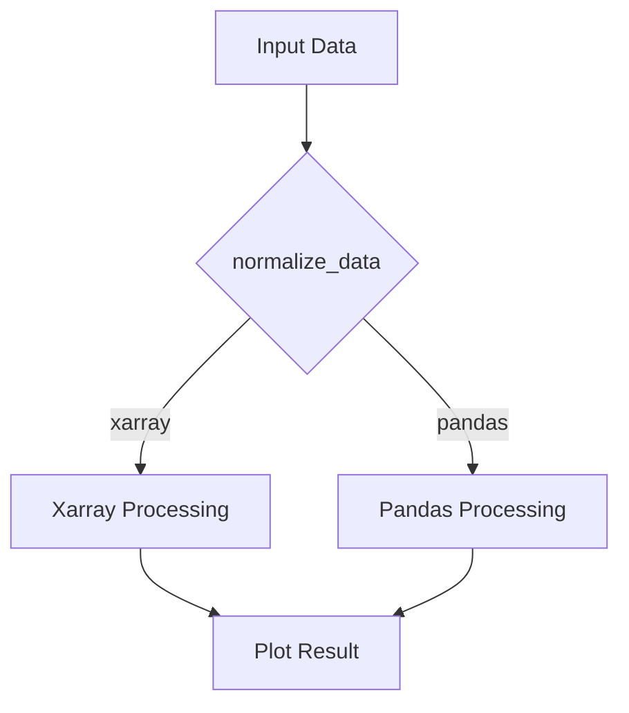

# Xarray Integration Guide

MONET Plots now supports direct plotting with xarray DataArrays and Datasets, providing better performance and integration with labeled multi-dimensional data.

## Overview

Previously, MONET Plots would automatically convert all input data to pandas DataFrames using the [`to_dataframe()`](src/monet_plots/plot_utils.py:7) function. While this provided a consistent interface, it had several limitations:

- **Performance overhead**: Unnecessary conversion from xarray to pandas
- **Loss of metadata**: Xarray attributes and coordinate information were lost
- **Limited functionality**: Couldn't leverage xarray's powerful built-in plotting capabilities

The new xarray integration preserves xarray objects throughout the plotting pipeline, enabling more efficient and feature-rich visualization.

## Key Changes

### New `normalize_data()` Function

The new [`normalize_data()`](src/monet_plots/plot_utils.py:175) function replaces the previous `to_dataframe()` approach:

```python
from monet_plots.plot_utils import normalize_data

# Preserves xarray objects instead of converting to pandas
data = normalize_data(xarray_dataset)  # Returns xarray.Dataset
pandas_df = normalize_data(pandas_dataframe)  # Returns pandas.DataFrame
```

### Updated TimeSeriesPlot

The [`TimeSeriesPlot`](src/monet_plots/plots/timeseries.py:9) class now automatically detects and handles xarray objects:

```python
from monet_plots.plots.timeseries import TimeSeriesPlot

# Works with pandas DataFrames (backward compatible)
plot = TimeSeriesPlot(pandas_df, x='time', y='value')

# Works with xarray DataArrays
plot = TimeSeriesPlot(xarray_dataarray, x='time', y='value')

# Works with xarray Datasets
plot = TimeSeriesPlot(xarray_dataset, x='time', y='variable_name')
```

## Usage Examples

### Basic Xarray Time Series Plot

```python
import xarray as xr
import pandas as pd
import numpy as np
from monet_plots.plots.timeseries import TimeSeriesPlot

# Create sample xarray data
dates = pd.date_range('2023-01-01', periods=100, freq='h')
temperature = 15 + 5 * np.sin(np.arange(100) * 2 * np.pi / 24) + np.random.normal(0, 1, 100)

da = xr.DataArray(
    temperature,
    dims=['time'],
    coords={'time': dates},
    name='temperature',
    attrs={'units': '°C', 'long_name': 'Air Temperature'}
)

# Create and plot
plot = TimeSeriesPlot(da, x='time', y='temperature',
                     title="Temperature Time Series",
                     ylabel="Temperature (°C)")
ax = plot.plot()
plot.save("temperature_timeseries.png")
plot.close()
```

### Xarray Dataset with Multiple Variables

```python
# Create xarray dataset with multiple variables
ds = xr.Dataset({
    'temperature': (['time'], 15 + 5 * np.sin(np.arange(100) * 2 * np.pi / 24) + np.random.normal(0, 1, 100)),
    'humidity': (['time'], 50 + 20 * np.sin(np.arange(100) * 2 * np.pi / 24) + np.random.normal(0, 5, 100)),
    'pressure': (['time'], 1013 + 5 * np.random.normal(0, 1, 100))
}, coords={'time': dates})

# Plot temperature from the dataset
plot = TimeSeriesPlot(ds, x='time', y='temperature',
                     title="Temperature from Dataset")
ax = plot.plot()
plot.save("dataset_temperature.png")
plot.close()
```

### Backward Compatibility with Pandas

```python
# Existing pandas code continues to work unchanged
df = pd.DataFrame({
    'time': dates,
    'value': np.random.normal(0, 1, 100),
    'units': 'm/s'
})

plot = TimeSeriesPlot(df, x='time', y='value',
                     title="Pandas DataFrame Plot")
ax = plot.plot()
plot.save("pandas_timeseries.png")
plot.close()
```

## Benefits of Xarray Integration

### 1. Performance

Xarray objects avoid unnecessary conversion to pandas DataFrames, reducing memory usage and improving performance for large datasets.

### 2. Metadata Preservation

Xarray attributes and coordinate information are preserved throughout the plotting process:

```python
da = xr.DataArray(
    data,
    attrs={'units': '°C', 'long_name': 'Temperature', 'instrument': 'thermometer'}
)
# Attributes are preserved and can be used in plots
```

### 3. Multi-dimensional Data

Xarray's native support for multi-dimensional data enables more sophisticated visualizations:

```python
# 2D xarray data
data_2d = xr.DataArray(
    np.random.randn(10, 20),
    dims=['time', 'space'],
    coords={'time': pd.date_range('2023-01-01', periods=10),
            'space': np.arange(20)}
)
```

### 4. Built-in Plotting Capabilities

The implementation leverages xarray's powerful built-in plotting methods for better visualization quality and consistency.

## Migration Guide

### For Existing Users

No changes are required! Your existing pandas-based code will continue to work exactly as before. The new xarray support is fully backward compatible.

### For New Projects

Consider using xarray for:
- **Time series data** with regular or irregular time coordinates
- **Multi-dimensional data** (e.g., time × space × variables)
- **Data with rich metadata** that should be preserved
- **Large datasets** where performance matters

## Technical Details

### Data Flow



### Implementation Strategy

The implementation uses a **duck typing** approach:

1. **Detection**: [`normalize_data()`](src/monet_plots/plot_utils.py:175) identifies the input data type
2. **Preservation**: Xarray objects are preserved; pandas objects remain pandas
3. **Routing**: Plot methods dispatch to appropriate handlers (`_plot_xarray()` vs `_plot_dataframe()`)
4. **Unification**: Common interface ensures consistent behavior

### Error Handling

The system gracefully handles edge cases:
- Missing xarray dependency (falls back to pandas)
- Invalid data structures (clear error messages)
- Mixed data types (automatic conversion where appropriate)

## Performance Comparison

### Memory Usage

```python
import sys
import numpy as np
import pandas as pd
import xarray as xr

# Large dataset
n = 1_000_000
data = np.random.randn(n)

# Pandas approach
df = pd.DataFrame({'time': pd.date_range('2023-01-01', periods=n), 'value': data})
print(f"Pandas memory: {sys.getsizeof(df)} bytes")

# Xarray approach
da = xr.DataArray(data, dims=['time'], coords={'time': pd.date_range('2023-01-01', periods=n)})
print(f"Xarray memory: {sys.getsizeof(da)} bytes")
```

### Processing Time

```python
# Xarray avoids conversion overhead
# For large datasets, this can be significant
```

## Future Enhancements

The xarray integration is designed to be extensible. Future improvements may include:

- **Additional plot types**: Extend xarray support to other plot classes
- **Advanced features**: Leverage xarray's groupby, resampling, and rolling operations
- **Spatial data**: Better integration with xarray's spatial coordinates
- **Dask integration**: Support for out-of-core computation with large datasets

## Troubleshooting

### Common Issues

**Issue**: `ModuleNotFoundError: No module named 'xarray'`

**Solution**: Install xarray with `pip install xarray` or `conda install xarray`

**Issue**: Plots look different between pandas and xarray versions

**Solution**: This is expected due to different plotting backends. Use the same data type for consistent results.

**Issue**: Performance is worse with xarray

**Solution**: Ensure you're using the latest versions and check for unnecessary data conversions in your pipeline.

## Conclusion

The xarray integration in MONET Plots provides a powerful new way to visualize scientific data while maintaining full backward compatibility. Whether you're working with time series, multi-dimensional data, or complex metadata, xarray support enables more efficient and feature-rich plotting.

For more information, see:
- [Xarray Documentation](https://xarray.dev/)
- [Pandas vs Xarray Comparison](https://xarray.dev/comparison.html)
- [MONET Plots API Reference](docs/api/index.md)